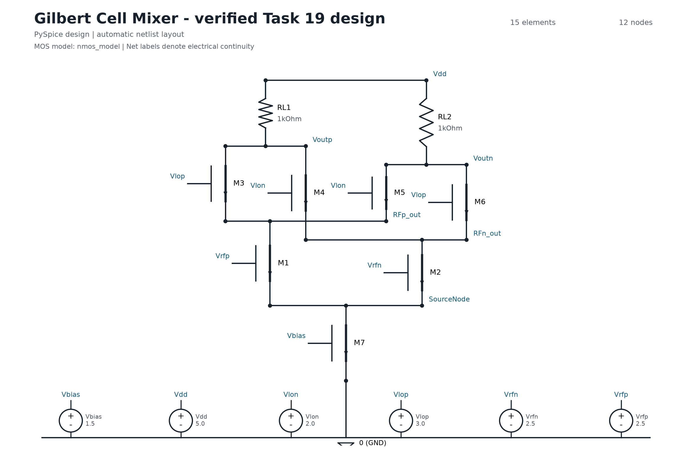
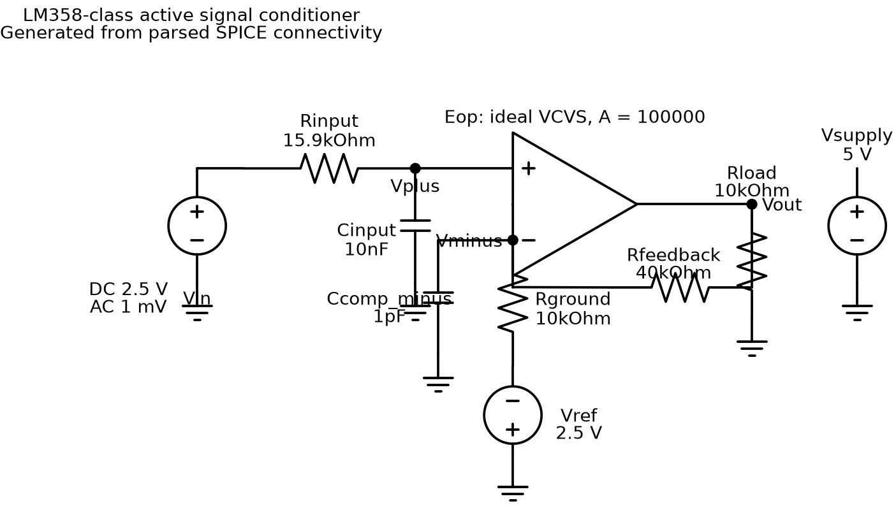

# AIscience

面向电路科研智能体的工程复现与能力验证。本仓库当前完成了 AnalogCoder-Pro 在
Windows、Python 3.13、Ngspice 46 和阿里百炼兼容接口下的复现，并增加了可审计实验记录、
LM358 类迁移任务以及从 PySpice 到原理图的自动导出链。

## 当前结果

| 测试 | 真实模型结果 | 结论 |
|---|---:|---|
| 官方 Task 19 Gilbert 混频器 | 3 次独立运行，2 次通过 | 闭环可工作，但成功率不是 100% |
| LM358 类有源信号调理 | 第 4 次独立运行通过全部 5 项指标 | 任务通过，限于理想运放抽象 |
| PySpice -> SPICE -> 原理图 | 10/10 元件、7/7 节点成功解析 | 已生成 SVG/PNG 工程制品 |

## 项目入口

- [完整复现项目](analogcoder-pro-reproduction/README.md)
- [给组长的展示汇报](analogcoder-pro-reproduction/docs/组长展示汇报.md)
- [相对论文代码的修改清单](analogcoder-pro-reproduction/docs/相对论文代码修改说明.md)
- [结构化实验汇总](analogcoder-pro-reproduction/results/summary.json)

### Gilbert 混频器参考基线

### 模型生成的 LM358 类信号调理电路

## 安全说明

仓库不包含 API Key、Ngspice DLL、Conda 环境、缓存或完整模型对话。API Key 只能通过
`DASHSCOPE_API_KEY` 环境变量提供；Ngspice 共享库通过 `NGSPICE_DLL_PATH` 指定。
