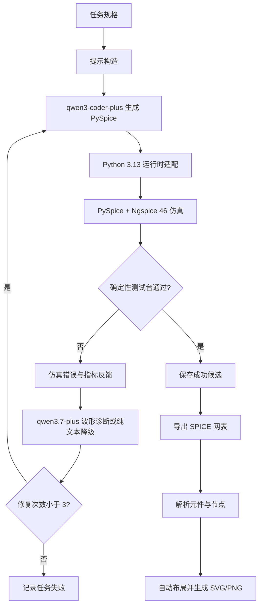

# AnalogCoder-Pro 复现与电路设计能力测试

本项目参考 AnalogCoder-Pro 公开代码，完成了一个可在 Windows、Python 3.13、Ngspice 46 和
阿里百炼 OpenAI Compatible API 下运行的模拟电路生成、仿真、反馈修复与判定闭环。

它不是论文全部功能的复刻。公开仓库缺少论文中的完整优化模块和 MOS 模型资源，因此这里聚焦
可验证的电路生成闭环，并明确区分环境复现、模型任务通过、模型任务失败和未经验证的功能。

## 已实现内容

1. 将论文代码适配到 Python 3.13、PySpice 1.5 和 Ngspice 46 shared-library 后端。
2. 接入百炼 `qwen3-coder-plus` 代码模型和 `qwen3.7-plus` 视觉诊断模型。
3. 增加有限 API 重试、认证错误快速失败、VLM 非致命降级和结构化运行记录。
4. 完成官方 Task 19 三次独立真实模型实验，结果为 2 次通过、1 次失败。
5. 新增 LM358 类有源信号调理任务、确定性测试台和自动修复闭环。
6. 新增 PySpice -> SPICE 网表 -> 元件/节点 JSON -> SVG/PNG 原理图导出链。
7. 保存成功代码、失败原因、token、波形、FFT、网表和原理图，形成可审计交付物。

## 总体框架



## 实验结论

### 官方 Task 19

测试目标是 Gilbert Cell 混频器。官方测试台执行 DC 偏置搜索、20 ms 瞬态仿真和 FFT，并检查
约 200 Hz 与 2.2 kHz 两个混频分量是否均超过 1 mV。

| 独立运行 | 最终状态 | 成功候选 | Token |
|---:|---|---:|---:|
| 0 | 失败 | 无，初始生成加 3 次修复均失败 | 19,472 |
| 1 | 通过 | 第 2 个候选 | 10,649 |
| 2 | 通过 | 第 4 个候选 | 19,005 |

独立复核时，运行 1 检测到 193.9 Hz/4.086 mV 和 2181.8 Hz/3.578 mV；运行 2 检测到
196.7 Hz/3.770 mV 和 2213.1 Hz/2.568 mV。三次总成功率为 2/3，而不是只汇报最好一次。

### LM358 类任务

规格为 5 V 单电源、2.5 V 输出偏置、100 Hz 增益约 5、截止频率约 1 kHz，并要求 100 mV 峰值
输入时不削顶。前 3 次独立运行失败，第 4 次运行的第 4 个候选通过：

| 指标 | 实测 | 判据 |
|---|---:|---:|
| 输出偏置 | 2.499875 V | 2.25--2.75 V |
| 100 Hz 增益 | 4.974985 V/V | 4.5--5.5 V/V |
| 截止频率 | 1000 Hz | 700--1300 Hz |
| 100 Hz 到 10 kHz 衰减 | 19.9917 dB | >= 15 dB |
| 瞬态输出范围 | 2.00238--2.99737 V | 0.2--4.8 V 且不削顶 |

这里使用高增益理想 VCVS 表示 LM358 类运放，不是厂商宏模型，因此不能外推压摆率、输入共模
范围、真实输出摆幅、噪声和温漂性能。

## 目录结构

```text
analogcoder-pro-reproduction/
|-- run.py                         # 论文主闭环的适配版本
|-- pyspice_runtime.py             # Ngspice 46 shared-library 配置
|-- problem_check/Mixer.py         # 官方 Task 19 测试台
|-- evaluation/lm358_conditioner/  # LM358 任务、智能体运行器和测试台
|-- repro_tools/                   # 环境检查、运行入口、网表解析和原理图生成
|-- deliverables/                  # 可直接查看/复测的成功设计
|-- results/                       # 三次 Task 19、四次 LM358 的精选实验记录
`-- docs/                          # 复现说明、修改清单和组长汇报
```

## 环境建立

要求：Windows、Anaconda/Miniconda、Python 3.13、Ngspice 46 shared DLL。

```powershell
conda env create -f environment.yml
conda activate analogcoderpro
```

`environment.yml` 已包含 PySpice、OpenAI SDK 和 SchemDraw。对于已有 Python 3.13 环境，可用
`pip install -r requirements.txt` 按固定版本补齐依赖。

设置运行时路径和百炼配置：

```powershell
$env:NGSPICE_DLL_PATH='C:\path\to\ngspice.dll'
$env:NGSPICE_EXECUTABLE='C:\path\to\ngspice_con.exe'
$env:DASHSCOPE_API_KEY='在当前终端设置，不要写入文件'
$env:BAILIAN_BASE_URL='https://dashscope.aliyuncs.com/compatible-mode/v1'
```

如果当前终端的 `python` 不是目标 Conda 环境，可设置：

```powershell
$env:ANALOGCODER_PYTHON='D:\path\to\envs\analogcoderpro\python.exe'
```

## 运行方法

```powershell
python repro_tools\check_environment.py
powershell -ExecutionPolicy Bypass -File repro_tools\run_task19.ps1
powershell -ExecutionPolicy Bypass -File repro_tools\run_lm358.ps1
```

不调用模型即可复核已交付的 LM358 成功设计：

```powershell
python evaluation\lm358_conditioner\checker.py `
  deliverables\lm358_success\design.py `
  --artifact-dir run_artifacts\lm358_recheck
```

单独导出任意满足接口的 PySpice 设计：

```powershell
python repro_tools\schematic\export_from_pyspice.py `
  deliverables\lm358_success\design.py `
  --output-dir run_artifacts\schematic_export
```

## 关键文档

- [复现与运行说明](docs/复现与运行说明.md)
- [相对论文代码修改说明](docs/相对论文代码修改说明.md)
- [给组长的展示汇报](docs/组长展示汇报.md)
- [结构化实验汇总](results/summary.json)
- [上游来源与引用](UPSTREAM.md)

## 能力边界

- 已验证：任务提示到 PySpice、仿真、反馈、修复、判定和工程导出的闭环。
- 部分通过：Task 19 真实模型成功率为 2/3，不能宣称稳定 100% 成功。
- 抽象验证：LM358 只验证理想运放拓扑和频率响应，不是器件级 sign-off。
- 未验证：论文未公开的优化代码、完整参数优化能力以及双向 DC-DC/Simscape 自动设计。

`dc_sweep_template.py` 含有运行时替换的 `IN_NAME` 占位符，本身不是可直接执行的 Python 模块；
`run.py` 生成候选时会先替换占位符，再执行生成后的扫描脚本。
