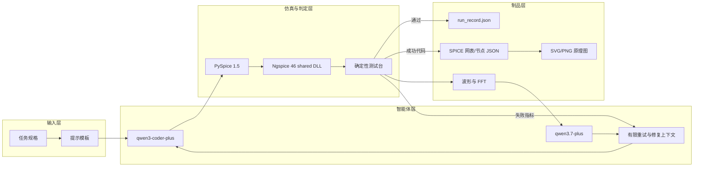

# AnalogCoder-Pro 复现与能力测试展示汇报

## 一、结论先行

本阶段完成了 AnalogCoder-Pro 公开代码的工程复现，并在真实百炼模型下完成两个层次的测试：

1. 官方 Task 19 Gilbert 混频器三次独立运行，2 次通过、1 次失败，成功率 2/3。
2. 自定义 LM358 类有源信号调理任务在第 4 次独立运行中通过全部五项确定性指标。
3. 成功设计可以自动导出 SPICE 网表、元件/节点结构、SVG 和 PNG 原理图。
4. 所有正式运行都保存模型、修复次数、token、耗时、代码、错误、波形和最终判定。

因此可以说明：目前已建立“规格 -> 代码生成 -> 电路仿真 -> 错误反馈 -> 自动修复 -> 测试判定
-> 工程制品”的可运行闭环。但不能说明论文完整优化功能已经复现，也不能据此证明系统已具备
双向 DC-DC 或真实器件级自动设计能力。

## 二、总体做了什么

### 1. 建立可运行环境

- 使用 Anaconda Python 3.13 环境，而不是论文 README 中的 Python 3.10。
- 安装 PySpice 1.5、OpenAI SDK、NumPy、SciPy、Pandas、Matplotlib、CFFI 和 SchemDraw。
- 复用本机 Ngspice 46，最终选择 shared DLL 后端连接 PySpice。
- 依次验证 Ngspice 基础网表、PySpice RC 电路、仓库 p1 和 Task 19 参考基线。

### 2. 适配真实模型接口

- 代码生成模型：`qwen3-coder-plus`。
- 视觉/波形诊断模型：`qwen3.7-plus`。
- API：阿里百炼 OpenAI Compatible Chat Completions。
- Key 只从环境变量读取，不写入代码和实验记录。

### 3. 跑通官方复现任务

使用官方 Task 19 提示和 Mixer 测试台，完成三次相互独立的真实模型生成。每次包含一个初始候选
和最多三次修复，不把失败运行删除，也不只选择最好一次汇报。

### 4. 增加新的能力测试

设计 LM358 类有源信号调理任务，要求 5 V 单电源、2.5 V 偏置、增益 5、1 kHz 截止频率和
100 mV 输入不削顶。新增独立测试台测量 DC、AC 和 transient 指标。

### 5. 增加工程化输出

成功 PySpice 代码不再只停留在波形图，而是自动导出 SPICE 网表，解析每个元件和节点，再生成
SVG/PNG 原理图，便于检查连接、归档和后续迁移到 EDA/Simulink 工具链。

## 三、项目实现框架

## 四、关键技术细节

### 1. PySpice 与 Ngspice 的连接

`ngspice_con.exe` 适合直接执行批处理网表，但其 `-s` 服务模式在 Windows 下不能稳定返回
PySpice 需要的二进制数据。因此新增 `pyspice_runtime.py`，显式加载 Ngspice 46 shared DLL，
注册 DLL 搜索目录，并将 PySpice 默认仿真器设置为 `ngspice-shared`。

### 2. 两层重试

- API 层重试：网络或服务错误，最多三次；401/403 立即停止。
- 电路层修复：初始设计加最多三次完整重写。

两层含义不同，并分别写入运行记录。这样不会把 API 中断统计成电路任务失败。

### 3. VLM 降级

当有波形且视觉模型可用时，将波形交给 `qwen3.7-plus` 辅助诊断；如果视觉请求超时，则保存
错误并继续使用 Ngspice 的文本错误和测试指标修复，避免辅助模型拖垮主流程。

### 4. 确定性测试

Task 19 使用官方判据：DC 搜索、20 ms transient、FFT，检查约 200 Hz 和 2.2 kHz 分量是否
大于 1 mV。LM358 测试台不询问 LLM 是否“看起来正确”，而是直接测量偏置、增益、截止频率、
衰减和输出范围，只有五项全部满足才返回成功。

### 5. 原理图自动生成

- MOS Gilbert Cell：根据 source-to-drain 连接推断级次，再放置 MOSFET、电阻和电源。
- LM358 类电路：解析 VCVS、RC、反馈和参考支路，使用 SchemDraw 标准符号布局。
- 导出结果保留原始网表和节点 JSON，可用于检查制图是否改变了电气连接。

## 五、相对论文公开代码做了哪些修改

| 类别 | 新增或修改内容 | 带来的结果 |
|---|---|---|
| Python 3.13 | 当前解释器运行子进程、UTF-8、无头绘图配置 | 不再混用系统 Python |
| Ngspice 46 | 新增 shared DLL 运行时适配 | RC、p1、p19、LM358 均可仿真 |
| 百炼接口 | 环境变量、代码/VLM 双模型参数 | 可用真实 Qwen 模型运行 |
| 稳定性 | 有限重试、认证快速失败、VLM 非致命降级 | 不再无限 sleep 或因 VLM 超时中断 |
| 日志 | 修正关闭文件后继续写入的问题 | 消除 `I/O operation on closed file` |
| 可审计性 | `run_record.json`、API events、token、耗时、环境信息 | 每次实验均可追踪 |
| LM358 测试 | 新增任务、运行器、参考基线和独立 checker | 可测试从论文任务向新任务迁移 |
| 工程输出 | 网表解析、布局器、SchemDraw、manifest | 成功代码自动变为可查看原理图 |
| 可移植脚本 | `ANALOGCODER_PYTHON` 或当前环境 python | 去除本机 Conda 路径硬编码 |

主程序相对公开 `run.py` 约新增 254 行、删除 114 行。完整逐项说明见
[相对论文代码修改说明](相对论文代码修改说明.md)。

## 六、实验结果

### Task 19 三次独立运行

| Run | 状态 | 修复过程 | Token | 主要结果 |
|---:|---|---|---:|---|
| 0 | 失败 | 4 个候选均未通过 | 19,472 | 奇异矩阵、变量错误或无混频分量 |
| 1 | 通过 | 第 2 个候选通过 | 10,649 | 193.9 Hz/4.086 mV，2181.8 Hz/3.578 mV |
| 2 | 通过 | 第 4 个候选通过 | 19,005 | 196.7 Hz/3.770 mV，2213.1 Hz/2.568 mV |

结论：环境和闭环复现成功；模型对该任务有能力，但三次成功率为 2/3，稳定性仍需提高。

### LM358 四次独立运行

| Run | 状态 | Token | 失败/成功原因 |
|---:|---|---:|---|
| 0 | 失败 | 9,804 | 生成代码的 PySpice import/API 错误 |
| 1 | 失败 | 14,069 | `circuit.Node`、`circuit.E` 等 API 幻觉 |
| 2 | 失败 | 10,240 | 已完成仿真，但参考分压器被加载，增益仅 3.648 |
| 3 | 通过 | 12,209 | 第 4 个候选采用刚性 2.5 V 参考，五项全过 |

成功方案指标：

| 指标 | 实测结果 |
|---|---:|
| 偏置 | 2.499875 V |
| 100 Hz 增益 | 4.974985 V/V |
| 截止频率 | 1000 Hz |
| 100 Hz 到 10 kHz 衰减 | 19.9917 dB |
| 100 mV 输入下输出范围 | 2.00238--2.99737 V |

## 七、展示时建议打开的成果

1. `README.md`：先展示总体闭环和结果表。
2. `results/task19/run_0/result_analysis.md`：说明失败也被保留和分类。
3. `results/task19/run_1/p19_1_1_figure.png`：展示 Task 19 成功波形/FFT。
4. `deliverables/lm358_success/response.png`：展示 AC 与 transient 测试。
5. `deliverables/lm358_success/schematic.png`：展示从代码到原理图的工程链。
6. `results/summary.json`：展示全部运行与 token 可被程序读取，不只是一份口头报告。

建议 10 分钟汇报顺序：2 分钟目标与框架、3 分钟 Task 19、3 分钟 LM358 与原理图、2 分钟
能力边界和下一步。

## 八、当前不足与下一步

1. 接入厂商 LM358 宏模型，增加压摆率、共模范围、负载、噪声和温漂测试。
2. 将测试规格改成统一 YAML/JSON，自动生成 checker 和汇总表。
3. 增加候选静态检查，减少 PySpice API 幻觉带来的无效调用。
4. 对 Task 19 扩大独立运行次数，给出置信区间而不是只看 3 次。
5. 双向 DC-DC 任务应转向 Simulink/Simscape，建立功率器件、PWM、控制器和工况模块库；当前
   SPICE 闭环可负责器件级子电路，但不能直接替代系统级闭环设计。
6. 若获得论文未发布的优化模块，再验证拓扑生成后的参数优化能力；当前不补造缺失代码。
